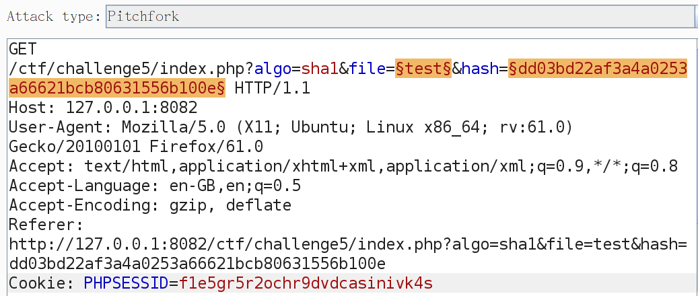
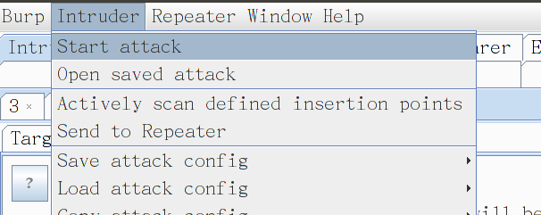
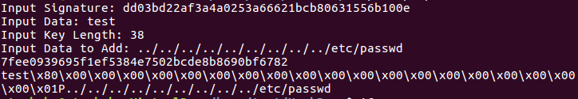
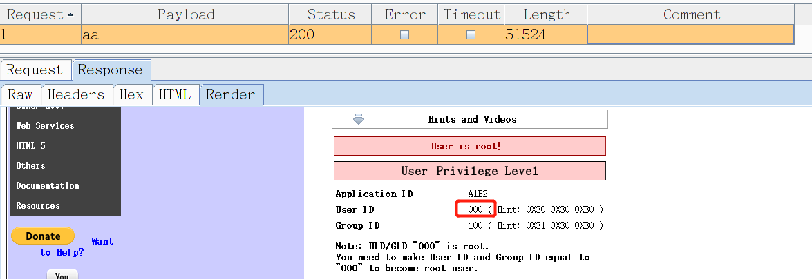

# Hash Length Extension Attack 实验报告

## 一. 环境配置

#### 1. 安装并配置Linux下Ubuntu16.04虚拟机

#### 2. 打开命令行，安装Docker主程序

[参考链接：https://docs.docker.com/install/linux/docker-ce/ubuntu/](https://docs.docker.com/install/linux/docker-ce/ubuntu/)

- 先卸载apt官方库里可能的docker旧版本：
```
$ sudo apt-get remove docker docker-engine docker-ce docker.io

```

- 更新apt包索引:

```
$ sudo apt-get update

```

- 安装以下包以使apt可以通过HTTPS使用存储库（repository）：


```
$ sudo apt-get install -y apt-transport-https ca-certificates curl software-properties-common

```

- 添加Docker官方的GPG密钥：

```
$ curl -fsSL https://download.docker.com/linux/ubuntu/gpg | sudo apt-key add -

```

- 使用下面的命令来设置stable存储库：

```
$ sudo add-apt-repository "deb [arch=amd64] https://download.docker.com/linux/ubuntu $(lsb_release -cs) stable"

```
- 再更新一下apt包索引：

```
$ sudo apt-get update

```
- 安装最新版本的Docker CE：

```
$ sudo apt-get install -y docker-ce

```

- 列出可用的版本：

```
$ apt-cache madison docker-ce

```
- 选择要安装的特定版本：

```
$ sudo apt-get install docker-ce=<docker-ce=18.03.0~ce-0~ubuntu>

```
- 通过运行hello-world，验证Docker CE是否正确安装。

```
$ sudo docker run hello-world

```

#### 3. 拉取镜像并直接在本地运行

```
$ sudo docker run -d --name cryptomg -p 8082:80 c4pr1c3/docker-cryptomg

```
至此，环境已经成功配置完成。

## 二. Introduction

[参考链接：https://github.com/iagox86/hash_extender](https://github.com/iagox86/hash_extender)

<br>

> An application is susceptible to a hash length extension attack if it prepends a secret value to a string, hashes it with a vulnerable algorithm, and entrusts the attacker with both the string and the hash, but not the secret. Then, the server relies on the secret to decide whether or not the data returned later is the same as the original data.

<br>

> It turns out, even though the attacker doesn’t know the value of the prepended secret, he can still generate a valid hash for {secret || file_name || padding || append_value}! This is done by simply picking up where the hashing algorithm left off;

<br>

> The problem is that we do not know the secret, and also do not know the length of the secret. 

<br>

- 根据以上原理，可以得到上述问题的解决办法。我们可以知道原始的data，Hash算法，和相应的签名。我们需要做的就是给原始的data加以填充，并附加一定长度的额外信息作为新数据，然后对新数据生成签名，虽然我们不知道secret的长度，但是可以进行穷举攻击，生成一系列的新数据，直到某一组数据命中。

## 三. Hash Length Extension Attack

#### 1.  在虚拟机中打开浏览器访问 http://127.0.0.1:8082/ctf/ ，可以看到：


#### 2. 选择点击Challenge 5，结果如下所示：


#### 3. 在Algorithms中选择‘sha1’，点击‘test’。然后在浏览器中按F12，选中Network标签页，点击相应的GET请求，观察Request Headers如下：

#### 【algo=sha1, file=test, and hash=dd03bd22af3a4a0253a66621bcb80631556b100e】

####  4. 在Algorithms中选择‘sha1’，点击‘pictures’。然后在浏览器中按F12，选中Network标签页，点击相应的GET请求，观察Request Headers如下：

#### 【algo=sha1,file=pictures, and hash= 4990d1bd6737cf3ae53a546cd229a5ff05f0023b】

<font color=red size=4>（从上述两个例子我们可以看出，两者的算法一致，文件内容不一致，hash值不一致。）</font>


file name | SHA1的hash值
---|---
hello | 93e8aee4ec259392da7c273b05e29f4595c5b9c6
home | 0028adb86aec37992e9453ec9adb0d259c82cfe2
links | 9578af94554b45d2fda9dec7727078d68d38b244
pictures | 4990d1bd6737cf3ae53a546cd229a5ff05f0023b
test | dd03bd22af3a4a0253a66621bcb80631556b100e


- The SHA1 hash of the word test is caa44616eed54257deeedb6b3508cefae7d4666d (echo -n test | sha1sum), the SHA1 sum of the word hello is d8ef3b7d2e6a8a6fdb8307dbc09759a5d1558e45 and the SHA1 sum of pictures is f7e22d3af5c9cd78567ed92d425695d33dcfe5d8. -
- These do not match the values that we receive from the server. The application is hashing something else, or is adding something to the hash besides the file name. This leads us to believe that we may be dealing with a Message Authentication Code (MAC). This is where a known value is appended to an unknown secret value and the resultant is hashed. As it turns out this form of creating a MAC is vulnerable to a **hash length extension attack**. 


## CryptOMG 
#### Installing CryptOMG 

```

$ sudo chomd o+w dirname   // exp： sudo chomd o+w /home
$ git clone https://github.com/SpiderLabs/CryptOMG.git
$ cd /home 
$ mkdir test
$ cd /home/test
$ git clone https://github.com/SpiderLabs/CryptOMG.git
$ sudo apt-get install libmcrypt4 php-mysql php-mcrypt
$ sudo phpenmod mcrypt            //加载mcrypt模块
$ sudo apt-get install apache2
$ sudo service apache2 restart

```


## Hash_extender

- 在Intrudiction中，最后提到，要实现攻击，我们需要做的就是给原始的data加以填充，并附加一定长度的额外信息作为新数据，然后对新数据生成签名。在这里使用hash_extender达到这个目的。


### Installing hash_extender

```
$ git clone https://github.com/iagox86/hash_extender.git
$ sudo apt-get remove openssl  //先删除旧版本的openssl
$ sudo apt-get install openssl  //安装openssl
$ sudo apt-get install libssl-dev  //允许用openssl进行编译
$ make   //编译
$ ./hash_entender    //运行

```

> 安装完成后，查看hash_extender的用法：


### Using hash_extender

- 在这里我们对challenge5进行攻击实验，所以设置The hash_type of the signature为‘**sha1**’，The original string that we're going to extend为‘**test**’，The original signature为‘**dd03bd22af3a4a0253a66621bcb80631556b100e**’（在上述实验过程中可以得到），设置The data to append to the string为‘**../../../../../../../../../etc/passwd**’，设置min secret length为**2**，设置max secret length为**40**。将最后的结果输出为**signatures-n-strings.out**。

> 具体命令如下：

```
$ ./hash_extender -f sha1 --data 'test' -s dd03bd22af3a4a0253a66621bcb80631556b100e --append '../../../../../../../../../etc/passwd' --secret-min=10 --secret-max=40 --out-data-format=html --table > signatures-n-strings.out

```
> 生成文件的部分截图：


> 将这个文件进行拆分，将第2列‘新签名’放到一个文件‘new sig’中，将第3列‘新数据’放到一个文件‘new data’中。

接着使用Burpsuite进行攻击实验。

## Burpsuite的安装及配置

#### 安装：

- 下载地址：http://pan.baidu.com/s/1kTiGgVP
- 解压密码是freebuf,解压文件后，得到以下两个文件：

- Burpsuite需要java支持，所以先安装java环境，打开命令行，输入：
```
$ sudo apt-get install default-jre

```
- 安装完成后，运行Burpsuite：
```
$ java -jar BurpLoader.jar

```


#### 配置：

> *在Firefox中，选择‘菜单 --> 选项  --> 网络代理设置’，按下图所示参数进行浏览器配置。*


> *在Burpsuite中，选择‘Proxy --> Options’,对跟浏览器相同的HTTP代理和端口进行配置。*


> *配置完成后选择‘Proxy --> Intercept --> Intercept is on’，等待抓包*


#### 利用Burpsuite进行Hash长度扩展攻击

- 刷新 http://127.0.0.1:8082/ctf/challenge5/ 页面，在Algorithms中选择‘sha1’，点击‘test’。

<br>

> 在Target中可以看到抓到了以下包：


<br>

- 选择第一个Status为200包，单击鼠标右键，选择‘Send to Intruder’ 


<br>

> 去Repeater中，可以看到以下内容：


<br>

- 在Attack type中选择‘Pitchfork’，对‘algo=§sha1§’和PHPSESSID=§f1e5gr5r2ochr9dvdcasinivk4§’进行‘Clear §’操作。

<br>

> 操作结果如下图所示：




- 选择‘Payloads’，在‘Payload type’中选择‘Runtime file’，会出现‘Select file’，
  - 在‘Payload set’为1时，选择在hash_extender中生成的‘new data’文件，在攻击时会替换上述的第一个黄色标记 **§test§**； 
  - 在‘Payload set’为2时，选择在hash_extender中生成的‘new sig’文件，在攻击时会替换上述的第二个黄色标记 **§dd03bd22af3a4a0253a66621bcb80631556b100e§**。


- 上述操作都完成后，在主菜单Intruder下选择‘Start attack’

> 如下图所示：




- 会弹出一个对话框，显示如下：


- 我们可以看出，在一系列数据中，只有一个Status=200，其余都为404 Not Found。说明该条数据攻击成功。该条数据的序号为33，之前的命令中，最小秘密长度设置为2，所以该条消息的秘密长度为33+2-1=34.

> 看一下这34bytes都是什么：


- Success! Without knowing the 34-character secret password we are still able to grab the contents of /etc/passwd through the hash length extension attack. 


## 其他工具的实现-HashPump
#### 安装HashPump：

```
$ git clone https://github.com/bwall/HashPump
$ sudo apt-get install g++ libssl-dev
$ cd HashPump
$ make
$ ./HashPump

```

#### 先看一下HashPump的帮助：

```
$ ./hashpump --help

```


> 运行hashpump，输入目标信息，得到新的data和新的签名，同样使用Brupsuite进行实验。在这里不重复。




#  CBC Bit-flipping Attack 实验报告

## 一. Environment configuration

- In the previous experiment, the virtual machine experiment environment was prepared in advance and the main docker program was installed. In this case, we only need to pull the image from the command line and run it directly locally。

```
$ sudo docker run -d --name mutillidae -p 8081:80 c4pr1c3/dockermutillidae


```

## 二. Cipher Block Chaining 

[参考链接：https://pentesterlab.com/exercises/padding_oracle/course](https://pentesterlab.com/exercises/padding_oracle/course)

CBC is an encryption mode in which the message is split into blocks of X bytes length and each block is XORed with the previous encrypted block. The result is then encrypted.


The following schema (source: [Wikipedia](https://en.wikipedia.org/wiki/Block_cipher_mode_of_operation#Cipher_Block_Chaining_(CBC))) explains this method(I made some modifications to this picture):


During the decryption, the reverse operation is used. The encrypted data is split in block of X bytes. Then the block is decrypted and XORed with the previous encrypted block to get the cleartext. 

The following schema (source:[ Wikipedia](https://en.wikipedia.org/wiki/Block_cipher_mode_of_operation#Cipher_Block_Chaining_(CBC))) highlights this behavior: 


Since the first block does not have a previous block, an initialization vector (IV) is used.

## 三. Detection of the vulnerability

To get started,open http://127.0.0.1:8081/ in Firefox. 

And then, click the hyperlink setup/reset the DB on the page to prompt "ok" to complete database initialization.

We can see:


<br>

In the left navigation bar, choose OWASP 2017 - > A2 - Broken Authentication and Session Management - > Priviliege Escalation - > Via CBC - bit Flipping in turn.

We can see:


We know **the aim of the experiment** is to make User ID and Group ID equal to
"000" to become root user.

## 四. Exploitation of the vulnerability

In order to exploit the vulnerability,we use the tool **'Brupsuite'**.  (More details on this tool have been written in the previous experiment)

First, start the Brupsuite and capture the packet 'http://127.0.0.1:8081/'.

We can see the init IV is 6bc24fc1ab650b25b4114e93a98f1eba:


Second, send the packet to the Repeater and the Intruder.

To testinformally using amanualmethod,the first character or two of the "iv" field canbe changed. In the Repeater,we changed the first two of the 'IV'field "00" . Indeed,the value of Application ID changes from "A1B2" to "*1B2".


Since there are only 32 characters in the "iv"parameter, manual analysis works well even if all positions need to be tested.

Some test:

IV | Application ID
---|---
6bc24fc1ab650b25b4114e93a98f1eba | A1B2
00c24fc1ab650b25b4114e93a98f1eba | *1B2
7bc24fc1ab650b25b4114e93a98f1eba | Q1B2
6cc24fc1ab650b25b4114e93a98f1eba | F1B2
6bd24fc1ab650b25b4114e93a98f1eba | A!B2
6bc64fc1ab650b25b4114e93a98f1eba | A5B2
6bc23fc1ab650b25b4114e93a98f1eba | A122
6bc24bc1ab650b25b4114e93a98f1eba | A1F2
6bc24fb1ab650b25b4114e93a98f1eba | A1BB
6bc24fc3ab650b25b4114e93a98f1eba | A1B0

When we changed the ninth bit and the tenth bit to 00,we can see the Application ID unchanged and the User ID changed.


From the test, we can find **the first octet** of the 'IV' control the Application ID.


Application ID | --- | ---|---|---|
---|---|------|---|---|
Position | 0 | 1 | 2 | 3
Value | 6b | c2 | 4f | c1
Effect |  A | 1 | B | 2


Repeat the test as before, we can get results as follow:


User  ID | --- | ---|---|
---|---|------|---
Position | 4 | 5 | 6 
Value | ab |  65 | 0b
Effect |  1 | 0 | 0


Group  ID | --- | ---|---|
---|---|------|---
Position | 7 | 8 | 9 
Value | 25 |  b4 | 11
Effect |  1 | 0 | 0


The two IV bytes (Position 4 and 7) identified can be altered manually until the User ID and Group ID read "000". The bytes are encoded as ASCII hex so there are 256 values for each byte ranging from 00 to FF.  However, switching the value and resubmitting the URL up to 512 times could be tiresome. Burp-Suite cantry all possible values of each byte.


> Burp - Suite Intruder Brute - Force payload configured to try ASCII hex values 00  - FF: (Position 4: ab)


> Attack result (We use the filter choose the result that we need.):





> Burp - Suite Intruder Brute - Force payload configured to try ASCII hex values 00  - FF: (Position 7: 25)


> Attack result (We use the filter choose the result that we need.):


We can get the conclusion that when the IV position 4 becomes to aa and the position 7 becomes to 24,the User ID and Group ID become 000.


## 五. Conclusion

Mutillidae chooses to remediate the bit-flipping vulnerability by preventing the user from changing the initialization vector. Because the IV can be private to the server in this use-case,keeping the IV from the user works well to fix the issue. In many cases, the IV must be changed frequently and/or passed between systems. In systems where the IV is only required to be uniqueand unpredictable, the integrity must be protected.

[参考链接：Learning CBC Bit-flipping Through Gamification by OWASP 2018.4](https://www.sans.org/reading-room/whitepapers/vpns/learning-cbc-bit-flipping-gamification-38375)